---

typora-copy-images-to: images
---

In this workshop, you will learn how to create your own chatbot using  **Visual Studio Code**, **Node.js** and the **Microsoft Bot Framework**.

> **There are two versions of this workshop**: you are currently reading the JavaScript one. If you're more of a C#/.NET person, switch to the [other one](README.md).
>
> English translation was kindly initiated by @Ellerbach.

## Assumptions

There will be a lot of copy-pasting in this workshop, but it's better to have a basic understanding of how web applications work and are built.

For reading documentation, finding solutions to problems in development and programming in general it is better to know **English**. This workshop is in English. Some of the screen captures are Czech as it was originally designed in Czech.

## Output

At the end of this exercise you will have a chatbot with two functionalities:

*Answer Yes/No to any question*


*Guessing names by face*


## Preparation

[Download](https://code.visualstudio.com/) and install **Visual Studio Code**. It's free and open-source.

[Download](https://github.com/Microsoft/BotFramework-Emulator/releases) and install the **Bot Framework Emulator**. Select the current version, *Setup ... exe*:


Make sure you have [Node.js](https://nodejs.org/) installed.

To connect to actual channels and QnA Maker (warm-up exercise), you will need a **Microsoft Azure subscription**.

## Warm-up: QnA

We're going to start our bot journey without coding, by creating a simple QnA bot.

1. Sign in to the [Azure Portal](https://portal.azure.com).

2. Click **+ Create a resource**.

3. Search for **Functions Bot**.

4. Click **Create**.

5. Enter a **name**, let it **create a resource group** and **app name** for you.

6. Pick the **Question and Answer** template in the **Node.js** section.

   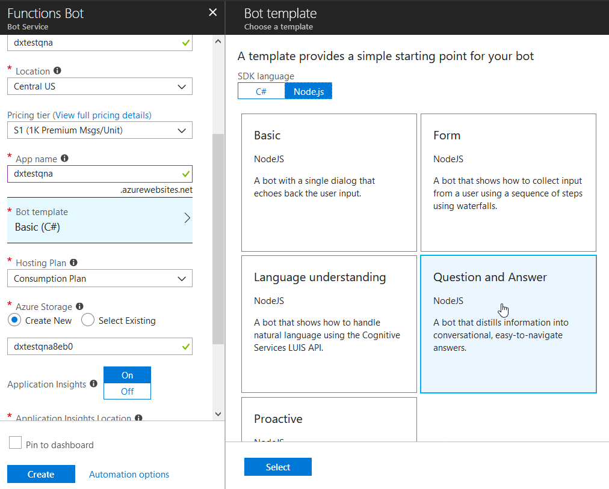

7. Confirm with the **Select** button.

8. Turn **Application Insights off**.

9. Finish by clicking **Create**.

This template unfortunately doesn't create the appropriate QnA Maker backend for our bot. We have to do it manually now and extract knowledge base ID and key.

1. Navigate to [QnA Maker](https://qnamaker.ai/) and **Sign in** with your Microsoft Account.
2. Select **Create new service**.
3. Enter a **name**.
4. As a **knowledge base URL** use any FAQ page you want to try, or enter `https://azure.microsoft.com/en-us/support/faq/`.
5. Click **Create**.

When the crawling finishes, you should see the contents of your FAQ in a table. If this falis, the site is probably not formatted properly for QnA crawling. Try another one or upload your questions and answers as a document.

Knowledge base is now ready, we only need to train it and publish it to make it available to our bot.

1. Click **Save and retrain**.

   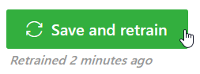

2. Click **Publish**.

   

3. And once again **Publish**.

The interface will show you a sample HTTP request. You need to extract two pieces of information from this screen: *knowledge base ID* and *key*.

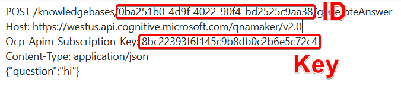

> **Note**: Don't try to exploit this code, it's not valid anymore :)

1. Return to the Azure Portal and open your knewly created bot.

2. Go to the **Build** blade.

3. Click **Open this bot in Azure Functions**.

   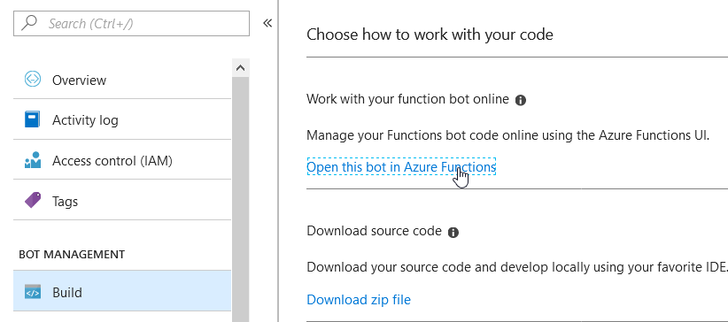

4. Click **Application settings**.

   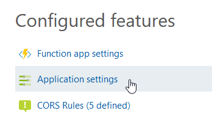

5. Enter the knowledge base ID and key values to appropriate settings (`QnAKnowledgebaseId` and `QnASubscriptionKey`). 

6. Scroll up and click **Save**.

7. Go back to your bot and switch to the **Test in Web Chat** blade.

8. Test your QnA bot.

   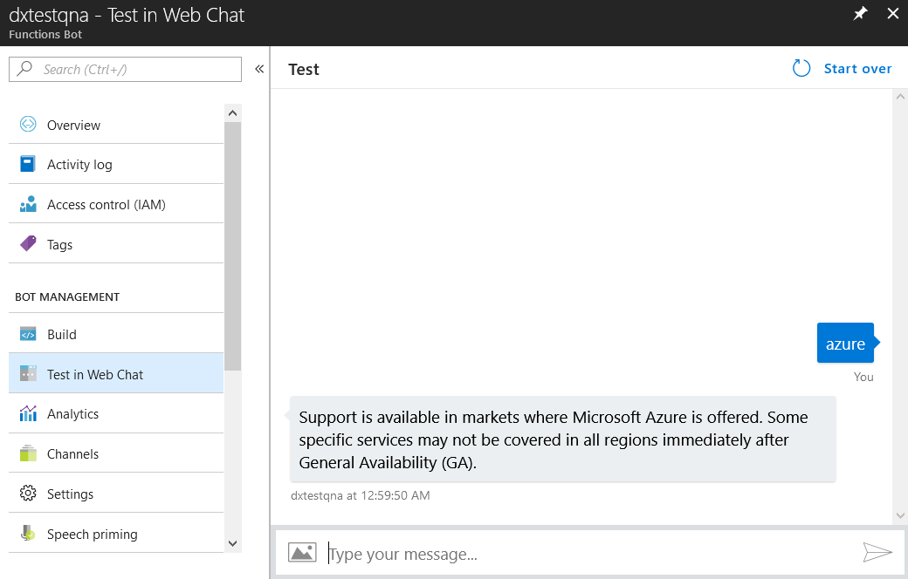

## First Bot: Yes/No?

In the first part you will learn the basic principles of creating a chatbot and structuring the code.

1. Create a folder where you'll put all your code.

2. Run **Visual Studio Code** and open this folder.

3. Initialize NPM by opening the Terminal and typing `npm init`.

   > **Hint**: In VS Code press F1, type "toggle terminal" and select **View: Toggle Integrated Terminal**.
   >
   > 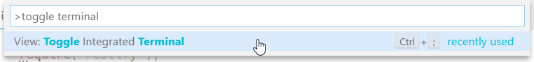

4. Go through the questions until the `package.json` file is created.

5. In the same folder create a new file, call it `yesnobot.js`.

We are going to start with just a "smoke test", to check that our bot responds and everything is set up properly.

Since chatbot is just a web API, we're going to need a web server. Bot Framework is compatible with *Restify* and *Express*, so let's use the former.

Get back to your **terminal** and **install package**:

```
npm install --save restify
```

Then install the Bot Builder SDK:

```
npm install --save botbuilder
```

And finally, one more package we will make use of later:

```
npm install --save request-promise
```

With that we're ready to start coding the bot. Go to **yesnobot.js** and put in the basics:

```javascript
//@ts-check
const restify = require('restify');
const builder = require('botbuilder');

const server = restify.createServer();
server.listen(process.env.port || process.env.PORT || 3979, function() {
    console.log("%s listening to %s", server.name, server.url);
});

const connector = new builder.ChatConnector({
    appId: process.env["MicrosoftAppId"],
    appPassword: process.env["MicrosoftAppPassword"]
});

server.post("/api/messages", connector.listen());
```

The server will listen for POST requests coming to `/api/messages` at the port 3979 (if not specified otherwise).

> **Hint**: VS Code comes with native support for TypeScript, but even if you prefer pure JavaScript, it's still nice to turn the type checking on by adding `//@ts-check` on top of every JS file.

Now add some simple functionality:

```javascript
const bot = new builder.UniversalBot(connector, function(session) {
    session.send(`You said ${session.message.text} which was ${session.message.text.length} characters`); 
});
```

You can now start the application using the **F5** key (or the green arrow "Play" button). A browser window opens. Go to **Bot Framework Emulator**, click on the box with the text **Enter your endpoint URL** and select your server address and port (in this case it should be *localhost:3979*):


The full address is `http://localhost:3979/api/messages`.

Leave the **Microsoft App ID** and **Microsoft App Password** fields blank and click **Connect**.

If you type something now, the bot will answer:


Good, we have checked that everything is working fine and can jump into the "serious" code.

### UniversalBot

In Visual Studio Code, stop Debugging (**Shift + F5** or the  "Stop" button):

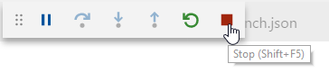

Delete the *waterfall* implementation from UniversalBot and keep it like this:

```javascript
const bot = new builder.UniversalBot(connector);
```

There's still a little bit of supporting functionality missing, so we're going to add a service.

### Services

This bot will be "smarter" (funnier) and use an external service. At http://yesno.wtf, there is a public API that randomly returns a "yes" or "no" and an appropriate GIF. Our bot, the consultant, will use it to answer any question. At the end of the day, you don't need anything than yes or no from a consultant :-)


First, prepare the *yes-no-service*:

1. Add new folder to the project by clicking the icon in VS Code. Name it **services**.

   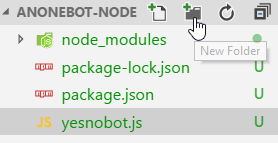

2. Add new file to this folder and call it **yes-no-service.js**.

   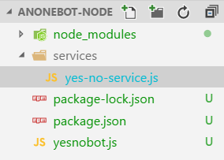

3. Complete the implementation:

```javascript
//@ts-check
const req = require("request-promise")

module.exports.get = (translate = false) => {
    return new Promise((resolve, reject) => {
        req.get("https://yesno.wtf/api/").then((resp) => {
            let r = JSON.parse(resp);
            if (translate)
                r.answer = _translate(r.answer);
            resolve(r);
        }).catch((error) => {
            console.log(`Error calling YesNo API. ${error}`);
            reject(error);
        });
    });
}

function _translate(yesNo) {
    let translation;

    switch (yesNo.toLowerCase()) {
        case "yes":
            translation = "Yes";
            break;
        case "no":
            translation = "No";
            break;
        default:
            translation = "I'm not sure";
            break;
    }

    return translation;
}
```
In this code, you can translate the answer into any language, just replace, the "*Yes*", "*No*", "*Maybe*" by any translation.


What's happening here?

Using the *request-promise* library, we will request a response from *YesNo API*.
* The received JSON string is parsed into a JavaScript object.

  ```javascript
  {"answer":"yes","forced":false,"image":"https://yesno.wtf/assets/yes/6-304e564038051dab8a5aa43156cdc20d.gif"}
  ```

* Optionally, the response gets translated.

* The completed response is returned for further processing.

### Root dialog - basic implementation

We will build only a single dialog for this bot and place it into a single file. In reality, you could have multiple dialogs in multiple files, calling each other and switching context.

Go back to **yesnotbot.js** and adjust the code to take advantage of the newly prepared service. What do we want the bot to do?

* Receive a message from the user.
* Check if it is a question.
* Request a Yes/No response from yes-no-service.
* Send this reply back to the user.

At the end of the file add the following:

```javascript
bot.dialog("/", [
    function(session) {
        if (!session.message.text.endsWith("?")) {
            session.send("That doesn't seem like a question.");
        }
        else {
            YesNoService.get(true).then((resp) => {
                session.send(resp.answer);
            });
        }
    }
]);
```

`YesNoService` will be underlined in red. Therefore, add at the beginning of the file (below `const builder...`) reference to our new service:

```javascript
const YesNoService = require('./services/yes-no-service');
```

Run the application (**F5**), go to **Bot Framework Emulator** and try to ask a question.


### Root dialog - with pictures

Bot Framework allows you to take advantage of graphical elements available on different chatbot channels. We will use the so-called *HeroCard* and in addition to the blunt Yes/No reply we send the user an animated GIF.

Replace the root dialog code with this one, using the Hero Card:

```javascript
bot.dialog("/", [
    function(session) {
        if (!session.message.text.endsWith("?")) {
            session.send("That doesn't seem like a question.");
        }
        else {
            YesNoService.get(true).then((resp) => {
                var msg = new builder.Message(session).addAttachment(createHeroCard(session, resp.answer, "", resp.image));
                session.send(msg);
            });
        }
    }
]);
```

And implement the function which generates this card:

```javascript
function createHeroCard(session, title, text, imageUrl) {
    return new builder.HeroCard(session)
            .title(title)
            .text(text)
            .images([builder.CardImage.create(session, imageUrl)]);
}
```

When you start the app now and ask the bot a question, you get a much richer response.


## Second Bot: Who is it?

In the second exercise, we add a new dialog to the chatbot and demonstrate how to work with user state. This extension will help remembering the names of new people. Bot will offer a photo and the user will guess the name of a person.

### Preparation

We will continue with the project we have built in the previous exercise, so there is no need to create a new one.

1. Create a new folder in the project, name it **assets**.

2. Get photos of people you want to learn and copy them into the **assets** folder.

   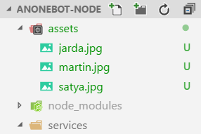

3. Add another service to the **services** folder. Call the file **people-service.js**.

4. Implement the service:

```javascript
//@ts-check
module.exports.get = () => {
    return [
        {image: "./assets/jarda.jpg", name: "Jarda"},
        {image: "./assets/martin.jpg", name: "Martin"},
        {image: "./assets/satya.jpg", name: "Satya"}
    ]
}
```

As you can see it's not an actual service, just a mock which returns image paths along with corresponding names.

### WhoIs dialog

This service will be consumed by our second dialog. To make things more modular and maintainable, we will put the implementation to a separate file.

1. Add new file to the root folder, call it **whois.js**.
2. Implement the *whois* dialog:

```javascript
//@ts-check
const builder = require('botbuilder');
const fs = require('fs');
const PeopleService = require('./services/people-service')

module.exports = [
    function(session) {
        if (session.message.text === "back") {
            session.endDialog();
            return;
        }
        
        if (session.conversationData.lastFaceName !== undefined) {
            const lastFace = session.conversationData.lastFaceName;
            if (session.message.text.toLowerCase() === lastFace.toLowerCase()) {
                session.send("Správně!");
            }
            else {
                session.send("Incorrect! It's **" + lastFace + "**.");
            }
        }

        showRandomFace(session);
    }
];


```

As you can see, the dialog waterfall can be exported from a module and consumed from another file.


Whenever a message comes from the user, we will first look to see if we have asked him about the name of the face. If so, we will pull out the information of this face (i.e., image and name).

```javascript
if (session.conversationData.lastFaceName !== undefined) {
    ...
}
```

And then we compare what came in the message with the name of the face. Depending on the evaluation, we will send the user an appropriate response.

```javascript
if (session.message.text.toLowerCase() === lastFace.toLowerCase()) {
    session.send("Správně!");
}
else {
    session.send("Incorrect! It's **" + lastFace + "**.");
}
```

At the end we will send a new face and wait for the answer again.

For the whole code to run, we must add the `showRandomFace()` function and its dependencies.

### Show Random Face

In this helper function we want to randomly select one from the list of faces, assemble the ThumbnailCard and send it back to the user.

```javascript
// ----
// support functions
// ----
function showRandomFace(session) {
    const faces = PeopleService.get();
    const rand = getRandomInt(faces.length);
    const face = faces[rand];
    // Bot Framework cards consume URL as the source for images.
    // We use Base64 in this case, but it could be any other internet-accessible image.
    const faceImage = "data:image/jpeg;base64," + base64_encode(face.image);

    // Saving last shown person's name to the state storage.
    // This is the way how you make information available to the bot between messages.
    // Otherwise it's stateless.
    session.conversationData.lastFaceName = face.name;
    // Using Thumbnail Card to make it different :)
    var msg = new builder.Message(session).addAttachment(createThumbnailCard(session, "Kdo je to?", "", faceImage));
    session.send(msg);
}

function createThumbnailCard(session, title, text, imageUrl) {
    return new builder.ThumbnailCard(session)
            .title(title)
            .text(text)
            .images([builder.CardImage.create(session, imageUrl)]);
}

function getRandomInt(max) {
    return Math.floor(Math.random() * Math.floor(max));
}

function base64_encode(file) {
    var bitmap = fs.readFileSync(file);
    return new Buffer(bitmap).toString('base64');
}
```

In the previous exercises we used `HeroCard`, now we are trying `ThumbnailCard`, which has a slightly different layout.

> For an overview of all card types, see [documentation](https://docs.microsoft.com/en-us/bot-framework/nodejs/bot-builder-nodejs-send-rich-cards).

There are two key elements in this method. After selecting a random face, we save it in `conversationData`, because when the user writes an answer, we want to check if it is correct (we already have it in the code above).

```c#
context.ConversationData.SetValue("LastFace", face);
```

The second important element is the generation of a "card" with a photo. The principle is the same as in the previous exercise, however here we're using a different approach. Bot Builder cards accept any image which conforms the the URL format - it can be provided from the internet or it can be encoded to base64 and provided directly as a string. And that's what's happening here.

```javascript
const faceImage = "data:image/jpeg;base64," + base64_encode(face.image);
...
function base64_encode(file) {
    var bitmap = fs.readFileSync(file);
    return new Buffer(bitmap).toString('base64');
}
```

Note that `context` is being forwarded to the getRandomFace method.

### Changing the dialog

Before you try the new dialog, you need to change the message routing so that the application uses the new *whois* dialog instead of the original one.

Go back to **yesnobot.js** and add a new dialog below the previous one:

```javascript
bot.dialog("whois", require("./whois")).triggerAction({matches: [/who/i, /whois/i]});
```

The `triggerAction` piece defines which keywords (a regular expression) will trigger this particular dialog. The trigger can be more sophisticated and involve natural language processing service.

If you run the application now and send the bot a "who" message. It should switch to the new dialog and respond with a picture:


To go back to the first dialog, just send "back".

## (Optional) Connection to actual channels

Chatting with Chatbot in the emulator is fun, but you can't offer it to other users in this way. If you want to tap into real channels (Skype, Messenger, etc.), you'll need to do a few more things.

To register a chatbot on the communication channels, you will need a **Microsoft Azure account**.

* [Trial](https://azure.microsoft.com/en-us/free/) It's free for the moon. You will receive a $100 credit for free use.
* [Dev Essentials](https://www.visualstudio.com/dev-essentials/) Includes a monthly renewal credit for one year.

Then, on [Microsoft Azure portal](https://portal.azure.com), you create a new source of type **Bot Channels Registration**.


Place it in the region **North Europe** and select the price level **F0**:


> So far leave the **Messaging endpoint** value empty, we will change it later.

Create a **Microsoft App ID and password** and select **Create New**. In the panel that opens, click **Create App ID in the App Registration Portal**.


Make a note of the generated **APP ID** (like in Notepad) and click the button. A password will appear **App Password** - also save it somewhere (when you click the popup, you can no longer get to it so really make sure you save it). Confirm and you can close this tab and return to the Azure portal.

Enter the newly collected data in the appropriate fields:


You can now complete the bot registration and confirm all open panels:


Click through your newly created Bot Service. For example, you'll see that in the **channels** section, you can choose which communication channels the bot will be available on.**Test in Web Chat** will be used to quickly try out the conversation (it won't work at the moment).

Let's adjust our bot code to use this new configuration. Go back to Visual Studo, enter the terminal and type:

```
npm install --save dotenv
```

Then create a new file in root and call it **.env**.

Contents of this file will be:

```
MicrosoftAppId=your App ID
MicrosoftAppPassword=your app password
```

And finally put this line to the top of **yesnobot.js**:

```javascript
require('dotenv').load();
```

This will make sure that environmental properties are loaded from the .env file.

Our chatbot code, the Web application that we created from scratch, must be accessible from the Internet. Therefore, you should deploy it to a Web server and obtain its HTTPS address. For testing, you can also reach the same effect directly from your computer using the [Ngrok](https://www.robinosborne.co.uk/2016/09/19/debugging-botframework-locally-using-ngrok/) tool.

> In practice, you would simply deploy the chabtot [for example, to Azure](https://almvm.azurewebsites.net/labs/vsts/appservice/).

To enter the address of the Web application with your Chatbot, go in the **Settings**, then to the field **Messaging endpoint**, and add `/api/messages` to the end:


Now when you run the app in Visual Studio and try to write to the bot in **Test in Web Chat**, it should start responding:


For Skype, add it in the **Channels** Section:


After saving, just click on Skype in the channel list and start chatting:


## Conclusion

In three sections, you learned how to create a simple chatbot using QnA Maker, more complex chatbot in Node.js, how to send to a user a message enriched with images, and how to work with the state between messages.

Possible additional extensions:

* Use root dialog as a router that will offer the user whether he wants to prefer to know the answer to the question or to learn the names.
* Ensure that the photos do not recur (i.e. not to show the same person several times until they are in the queue next).
* Load photos and people names dynamically, for example, from Office 365.
* Store the user states in your own table or SQL Database

## Additional Resources

* [Official documentation](https://docs.microsoft.com/en-us/bot-framework/)
* [Setup communication channels](https://docs.microsoft.com/en-us/bot-framework/bot-service-manage-channels)