---

typora-copy-images-to: images
---

In this workshop, you will learn how to create your own chatbot using  **Visual Studio 2017**, **C#** language and **Microsoft Bot Framework**.

## Assumptions

It¨s good to have a basic understanding of how web applications work and how are they built.

For reading documentation, finding solutions to problems in development and programming in general it is better to know **English**. This workshop is in English. You'll find some screen captures in Czech as it was originally designed by [@msimecek](https://github.com/msimecek).

## Output

At the end of this exercise you will have a chatbot with two functionalities:

*Answer Yes/No to any question*


*Guess names by face*

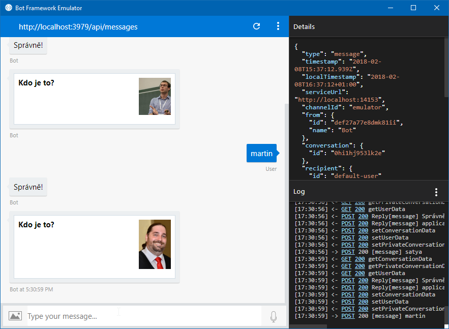

## Preparation

[Download](https://www.visualstudio.com/) and install Visual Studio 2017. The **Community** edition is enough and free.

When installing, select mainly **ASP.NET and web development**:

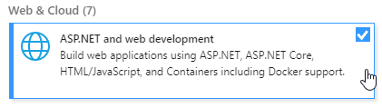

[Download](https://github.com/Microsoft/BotFramework-Emulator/releases) and install the **Bot Framework Emulator**. Select the current version, *Setup ... exe*:

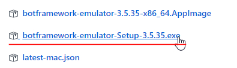

Download Visual Studio templates for [projects](http://aka.ms/bf-bc-vstemplate) and files ([controller](http://aka.ms/bf-bc-vscontrollertemplate), [dialog](http://aka.ms/bf-bc-vsdialogtemplate)). Copy the ZIP files directly to Visual Studio folders, **don't extract them**.

* *Bot Application.zip* belongs to `%USERPROFILE%\Documents\Visual Studio 2017\Templates\ProjectTemplates\Visual C#\`
* *Bot Controller.zip* and *Bot Dialog.zip* belongs to `%USERPROFILE%\Documents\Visual Studio 2017\Templates\ItemTemplates\Visual C#\`

Start **Visual Studio 2017** and verify that you have a project of type **Bot Application** in the **New Project** section:

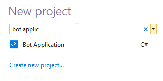

Run **Bot Framework Emulator**.

## First Bot - Yes/No?

In the first part you will learn the basic principles of creating a chatbot and structuring the code.

1. Create a new **Bot Application** project in Visual Studio 2017.

2. Choose the name you like, for example "*AnoNeBot*".

   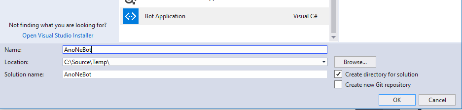

3. The basic chatbot skeleton is generated.

4. Press the **F6** key (or select Menu **Build > Build Solution**). Wait a few seconds so that the necessary packages get downloaded.

5. Right-click the project and select **Manage NuGet packages...**

   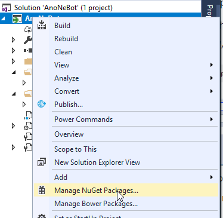

6. SELECT **Updates**, then select **Select All Packages** and click **Update**. 

7. If any other available updates appear, repeat this procedure.

> In general, it's better to begin development with updated packages.

The preparation is done. Now when you start the application with the **F5** key (or the green "Play" button), a browser window opens. Go to **Bot Framework Emulator**, click on the box with the text **Enter your endpoint URL** and select the same server as in the browser (in this case it should be localhost:3979):

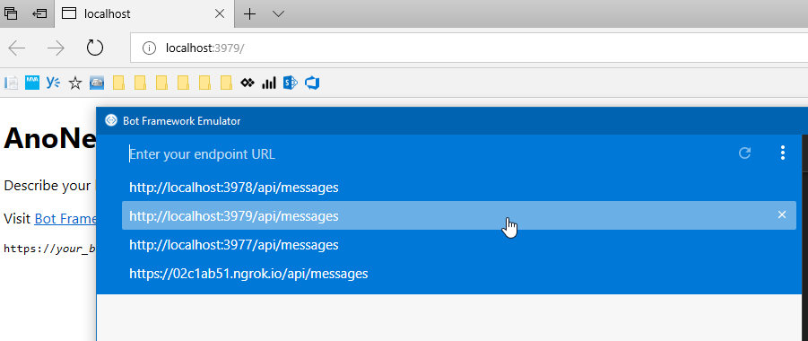

The full address is `http://localhost:3979/api/messages`.

Leave the **Microsoft App ID** and **Microsoft App Password** fields blank and click **Connect**.

If you write something now, the bot will answer:

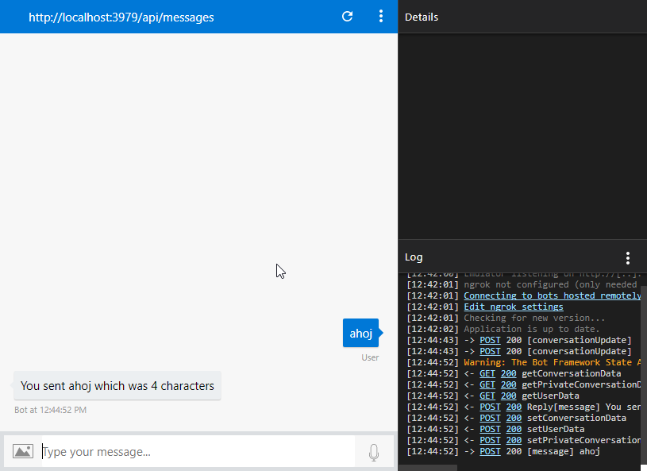

So we have checked that everything is working and can now jump into some more sophisticated code.

### MessagesController

In Visual Studio, stop debugging (**Shift + F5** or the  "Stop" button):

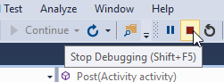

In the Solution Explorer panel, expand the **Controllers** folder and look for the file **MessagesController.cs**.

The 'Post()' method is essential, it is where every message from the user comes (the application exposes it at `/api/messages`). From there it goes into a dialog - in our case it's `RootDialog`.

> Chatbot is actually a web application, specifically [API](https://cs.wikipedia.org/wiki/API). In C#, we use the technology *ASP.NET WebAPI*. The alternative can be JavaScript and *Node. js*.

### RootDialog preparation

In the Dialogs folder, you can find the **RootDialog.cs** file. The `RootDialog` class implements the interface `IDialog<object>` and processes a message from a user in the `MessageReceivedAsync()` method. 

An important parameter is `context` of type `IDialogContext`, which is forwarded between all operations within the dialog and determines where the incoming message belongs.

> Message from the user is not just text, but also contains a lot of information - author name, account, date, conversation and dialogue, where it belongs, status information, etc.

```c#
public Task StartAsync(IDialogContext context)
{
    ...
}

private async Task MessageReceivedAsync(IDialogContext context, IAwaitable<object> result)
{
    ...
}
```

When you edit the text that is sent as a parameter to the `PostAsync()` method, you can change the response. Simple...

```c#
await context.PostAsync($"You sent {activity.Text} which was {length} characters");
```

### Services

This bot will be "smarter" (funnier) and use an external service. At http://yesno.wtf, there is a public API that randomly returns a "yes" or "no" and an appropriate GIF. Our bot, the consultant, will use it to answer any question. At the end of the day, you don't need anything than yes or no from a consultant :-)


First, prepare the YesNoService:

1. In the Solution Explorer pane, create a new folder in the project. Call it **Services**.

   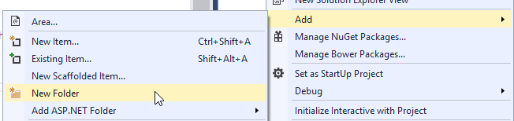

2. Right click the folder and select **Add > Class...**

3. Name the file **YesNoService.cs**.

4. Complete the implementation:

```c#
public class YesNoService
{
    public static async Task<YesNoModel> GetYesNoAsync(bool translate = false)
    {
        HttpResponseMessage res;

        using (HttpClient hc = new HttpClient())
        {
            res = await hc.GetAsync("https://yesno.wtf/api/");
        }

        if (res.IsSuccessStatusCode)
        {
            var yesNo = JsonConvert.DeserializeObject<YesNoModel>(await res.Content.ReadAsStringAsync());
            if (translate)
                yesNo.Answer = Translate(yesNo.Answer);

            return yesNo;
        }
        else
            return null;
    }

    public static string Translate(string yesNo)
    {
        string translation;

        switch (yesNo.ToLower())
        {
            case Answers.Yes:
                translation = "Yes";
                break;
            case Answers.No:
                translation = "No";
                break;
            default:
                translation = "Maybe";
                break;
        }

        return translation;
    }
}
```

> Note: In this code, you can translate the answer to any language, just replace, the "Yes", "No", "Maybe" by any translation.

What's happening here?

Using HttpClient, we will request a response from *YesNo API*.
* The received JSON string is converted using the *Json.NET* library to a C# object.
* The response is optionally translated.
* Finalized response is then returned for further processing.

The code is now full of expressions underlined with red squiggly lines. We will ignore it as of now and begin to add what is missing.

* *YesNo API* returns a result in JSON format:

```json
{"answer":"yes","forced":false,"image":"https://yesno.wtf/assets/yes/6-304e564038051dab8a5aa43156cdc20d.gif"}
```

We will prepare a corresponding class in C#.

1. Add a new folder to the project, name it **Models**.
2. Add a new class to it (**Add > Class...**).
3. Name the file **YesNoModel.cs**.
4. Complete the implementation:

```c#
public class YesNoModel
{
    public string Answer { get; set; }
    public bool Forced { get; set; }
    public string Image { get; set; }
}
```

To make our life easier in the future, we will add the same constants for each type of answer:

```c#
public static class Answers
{
    public const string Yes = "yes";
    public const string No = "no";
    public const string Maybe = "maybe";
}
```

The whole **YesNoModel.cs** will look like this:

```c#
namespace AnoNeBot.Models
{
    public class YesNoModel
    {
        public string Answer { get; set; }
        public bool Forced { get; set; }
        public string Image { get; set; }
    }

    public static class Answers
    {
        public const string Yes = "yes";
        public const string No = "no";
        public const string Maybe = "maybe";
    }
}
```

Return to **YesNoService.cs** and add the following at the beginning of the file:

```c#
using AnoNeBot.Models;
using Newtonsoft.Json;
using System.Net.Http;
using System.Threading.Tasks;
```

All red underlines should disappear.

### RootDialog basic implementation

Now adjust the *RootDialog* to take advantage of the newly prepared service. What do we want the bot to do?

* Receive a message from the user.
* Check if it is a question.
* Request a Yes/No response from YesNoService.
* Send this reply back to the user.

Locate the **MessageReceivedAsync()** in the **RootDialog.cs** file and edit it as follows:

```c#
private async Task MessageReceivedAsync(IDialogContext context, IAwaitable<object> result)
{
    var activity = await result as Activity;

    if (!activity.Text.EndsWith("?"))
    {
        await context.PostAsync("That's interesting, but until I don't get a question, I can't help you...");
    }
    else
    {
        var yesNo = await YesNoService.GetYesNoAsync(true);
        await context.PostAsync(yesNo.Answer);
    }
            
    context.Wait(MessageReceivedAsync);
}
```

`YesNoService` will be underlined. Therefore, add at the beginning of the file:

```c#
using AnoNeBot.Services;
```

Run the application (**F5**), go to **Bot Framework Emulator** and try to ask a question.


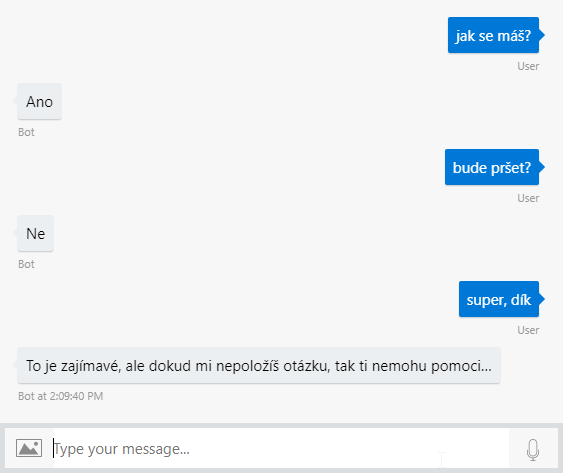

### RootDialog with pictures

Bot Framework allows you to take advantage of graphical elements available on different chatbot channels. We will use the so-called *HeroCard* and in addition to the blunt Yes/No reply we send the user an animated GIF.

Modify the **MessageReceivedAsync()** method code to use the card:

```c#
private async Task MessageReceivedAsync(IDialogContext context, IAwaitable<object> result)
{
    var activity = await result as Activity;

    if (!activity.Text.EndsWith("?"))
    {
        await context.PostAsync("That's interesting, but until I don't get the question, I can't help you...");
    }
    else
    {
        var yesNo = await YesNoService.GetYesNoAsync(true);

        var reply = activity.CreateReply();
        var card = new HeroCard(yesNo.Answer)
        {
            Images = new List<CardImage>()
            {
                new CardImage(yesNo.Image)
            }
        };

        reply.Attachments.Add(card.ToAttachment());
        await context.PostAsync(reply);
    }
            
    context.Wait(MessageReceivedAsync);
}
```

And add at the beginning of the file:

```c#
using System.Collections.Generic;
```

When you start the app now and ask the bot a question, you get a much richer response.

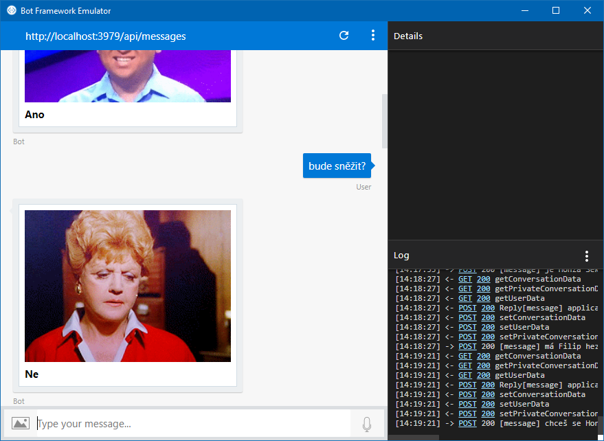

## Second Bot - who is it?

In the second exercise, we add a new dialog to the chatbot and demonstrate how to work with user state. This extension will help remembering the names of new people. Bot will offer a photo and the user will guess the name of a person.

### Preparation

We will continue with the project we have built in the previous exercise, so there is no need to create a new one.

1. Create a new folder in the project, name it **Assets**.

2. Get photos of people you want to learn and copy them into the **Assets** Folder (right-click in Visual Studio > **Add > existing Item...**).

   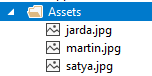

3. Add a new class to the **Models** folder. Name it **PeopleModel** (Add > Class... > PeopleModel.cs).

4. Complete the implementation (replace the values with your file names and name, or add more lines):

```c#
public class PeopleModel
{
    public static Dictionary<string, string> People = new Dictionary<string, string>()
    {
        { "Assets/jarda.jpg", "Jarda" },
        { "Assets/martin.jpg", "Martin" },
        { "Assets/satya.jpg", "Satya" }
    };
}
```

5. Add a using at the beginning of the file:

```c#
using System.Collections.Generic;
```

So we're done for data source preparation. Bot will draw from the list of `People` and randomly send pictures and check the correctness of the name (first and second value). We'll wrap this whole functionality into a new dialogue.

### WhoIsDialog

Create a new file type **Bot Dialog** in the folder **Dialogs** and file name **WhoIsDialog.cs** and insert the implementation of the `MessageReceivedAsync()` method:

```c#
private async Task MessageReceivedAsync(IDialogContext context, IAwaitable<object> result)
{
    var activity = await result as IMessageActivity;

    if (context.ConversationData.ContainsKey("LastFace"))
    {
        var lastFace = context.ConversationData.GetValue<KeyValuePair<string, string>>("LastFace");
            
        if (activity.Text.ToLower() == lastFace.Value.ToLower())
        {
            await context.PostAsync("Correct!");
        }
        else
        {
            await context.PostAsync("Error! It's " + lastFace.Value);
        }
    }

    await ShowRandomFaceAsync(context);

    context.Wait(MessageReceivedAsync);
}
```

Add the missing using at the beginning of the file:

```c#
using System.Collections.Generic;
```

Whenever a message comes from the user, we will first look to see if we have asked him about the name of the face. If so, we will pull out the information of this face (i.e., image and name).

```c#
var lastFace = context.ConversationData.GetValue<KeyValuePair<string, string>>("LastFace");
```

And then we compare what came in the message with the name associated with the face.

```c#
if (activity.Text.ToLower() == lastFace.Value.ToLower())
```

> In our case `lastFace.Value` contains the name and `lastFace.Key` the picture.

Depending on the evaluation, we will send the user an appropriate response.

At the end we will send a new face and wait for the answer again.

In order for the bot to function, it remains below in the *MessageReceivedAsync()* to add a method `ShowRandomFaceAsync()`.

### ShowRandomFace

In this helper method we want to randomly select one from the list of faces, assemble the *ImageCard* and send it to the user.

```c#
private async Task ShowRandomFaceAsync(IDialogContext context)
{
    Random rand = new Random();
    var face = PeopleModel.People.ElementAt(rand.Next(0, PeopleModel.People.Count));

    context.ConversationData.SetValue("LastFace", face);

    var root = HttpContext.Current.Request.Url.GetLeftPart(UriPartial.Authority) + "/";
    var card = new ThumbnailCard("Who is it?", images: new List<CardImage>() { new CardImage(root + face.Key) });

    var message = context.MakeMessage();
    message.Attachments.Add(card.ToAttachment());

    await context.PostAsync(message);
}
```

Add the missing using at the beginning of the file:

```c#
using AnoNeBot.Models;
using System.Linq;
using System.Web;
```

In the previous exercises we used `HeroCard`, now we are trying `ThumbnailCard`, which has a slightly different layout.

> For an overview of all card types, see [documentation](https://docs.microsoft.com/en-us/bot-framework/nodejs/bot-builder-nodejs-send-rich-cards).

Two elements are key in this method. After selecting a random face, we save it in `ConversationData`, because when the user writes an answer, we will want to check if it is correct (we already have it in the code above).

```c#
context.ConversationData.SetValue("LastFace", face);
```

The second important element is the generation of a "card" with a photo. The principle is the same as in the previous exercise, however here we need to compile the web address of the image dynamically because we host it on the webserver ourself.

```c#
var root = HttpContext.Current.Request.Url.GetLeftPart(UriPartial.Authority) + "/";
...
new CardImage(root + face.Key) // face.Key => "Assets/martin.jpg"
```

Then we send the result to the user.

> Note that `context` is being forwarded to the method.

The whole `WhoIsDialog` should look like this:

```c#
[Serializable]
public class WhoIsDialog : IDialog<object>
{
    public Task StartAsync(IDialogContext context)
    {
        context.Wait(MessageReceivedAsync);

        return Task.CompletedTask;
    }

    private async Task MessageReceivedAsync(IDialogContext context, IAwaitable<object> result)
    {
        var activity = await result as IMessageActivity;

        if (context.ConversationData.ContainsKey("LastFace"))
        {
            var lastFace = context.ConversationData.GetValue<KeyValuePair<string, string>>("LastFace");

            if (activity.Text.ToLower() == lastFace.Value.ToLower())
            {
                await context.PostAsync("Correct!");
            }
            else
            {
                await context.PostAsync("Error! It's  " + lastFace.Value);
            }
        }

        await ShowRandomFaceAsync(context);

        context.Wait(MessageReceivedAsync);
    }

    private async Task ShowRandomFaceAsync(IDialogContext context)
    {
        Random rand = new Random();
        var face = PeopleModel.People.ElementAt(rand.Next(0, PeopleModel.People.Count));

        context.ConversationData.SetValue("LastFace", face);

        var root = HttpContext.Current.Request.Url.GetLeftPart(UriPartial.Authority) + "/";
        var card = new ThumbnailCard("Who is it?", images: new List<CardImage>() { new CardImage(root + face.Key) });

        var message = context.MakeMessage();
        message.Attachments.Add(card.ToAttachment());

        await context.PostAsync(message);
    }
}
```

### Changing the dialog

Before you try the new dialog, you need to change the message routing in the **MessagesController.cs** so that the application uses the new WhoIsDialog instead of RootDialog.

```c#
public async Task<HttpResponseMessage> Post([FromBody]Activity activity)
{
    if (activity.Type == ActivityTypes.Message)
    {
        //await Conversation.SendAsync(activity, () => new Dialogs.RootDialog());
        await Conversation.SendAsync(activity, () => new Dialogs.WhoIsDialog());
    }
    else
    {
        HandleSystemMessage(activity);
    }
    var response = Request.CreateResponse(HttpStatusCode.OK);
    return response;
}
```

If you run the application now and write a message to the chatbot, you should get a picture response:


## (Optional) Connection to actual channels

Chatting with Chatbot in the emulator is fun, but you can't offer it to other users in this way. If you want to tap into real channels (Skype, Messenger, etc.), you'll need to do a few more things.

To register a chatbot on the communication channels, you will need a **Microsoft Azure account**.

* [Trial](https://azure.microsoft.com/en-us/free/) is for free for one month. You will receive a $200 credit for free use.
* [Dev Essentials](https://www.visualstudio.com/dev-essentials/) includes the trial credit, all free services and handful of paid services for one year.

Then, on [Microsoft Azure portal](https://portal.azure.com), you create a new resource of type **Bot Channels Registration**.

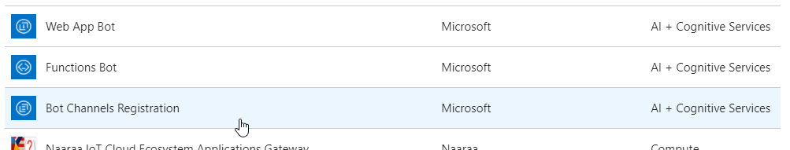

Place it in the region **North Europe** and select the price level **F0**:

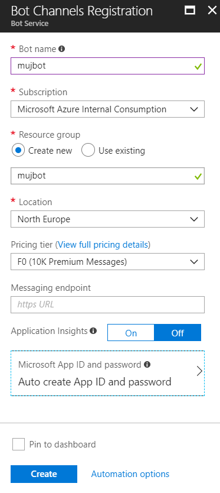

> So far leave the **Messaging endpoint** value empty, we will change it later.

Create a **Microsoft App ID and password** and select **Create New**. In the panel that opens, click **Create App ID in the App Registration Portal**.

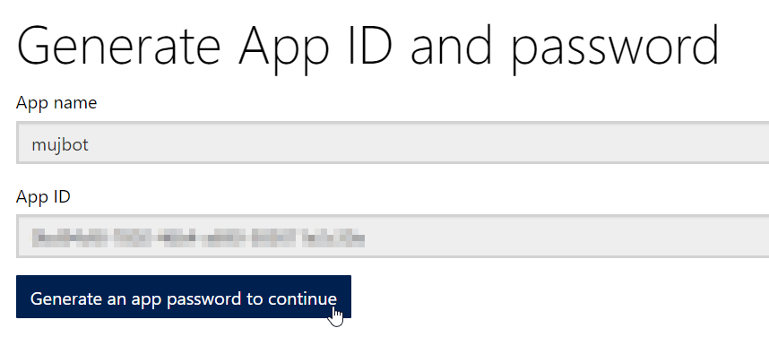

Make a note of the generated **APP ID** (like in Notepad) and click the button. A password will appear in the box **App Password** - save it somewhere too (when you close the popup, you can no longer get to it, so really make sure you save it). Confirm and you can close this tab and return to the Azure portal.

Enter the newly collected data in the appropriate fields:

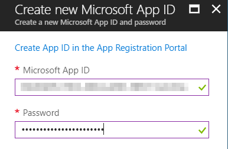

And also in Visual studio to the **Web.config** file:

```xml
<add key="BotId" value="mujbot" />
<add key="MicrosoftAppId" value="App ID here" />
<add key="MicrosoftAppPassword" value="App Password here" />
```

You can now complete the bot registration and confirm all open panels:

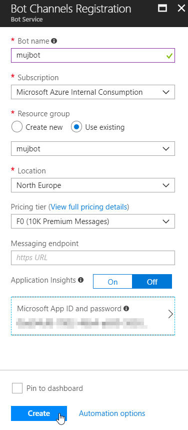

Click through your newly created Bot Service. For example, you'll see that in the **channels** section, you can choose which communication channels the bot will be available on. **Test in Web Chat** will be used to quickly try out the conversation (it won't work at the moment).

The chatbot code, the web application that we created from scratch, must be accessible from the internet. Therefore, you should deploy it to a web server and obtain its HTTPS address. For testing, you can also achieve the same effect directly from your computer using the [Ngrok](https://www.robinosborne.co.uk/2016/09/19/debugging-botframework-locally-using-ngrok/) tool.

> In practice, you would simply deploy the chatbot [to Azure, for example](https://almvm.azurewebsites.net/labs/vsts/appservice/).

To set the address of the web application in your chatbot, go to **Settings**, then to the field **Messaging endpoint**, and add `/api/messages` to the end:

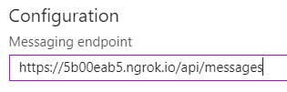

When you run the app in Visual Studio and try to communicate with the bot in **Test in Web Chat**, it should start responding:

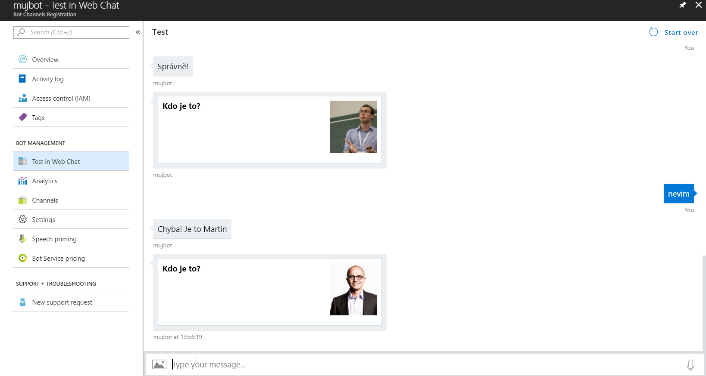

For Skype, add it to the **Channels** section:

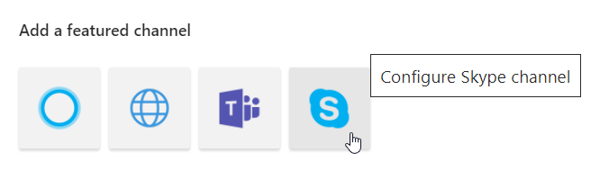

After saving, just click Skype in the channel list and start chatting:

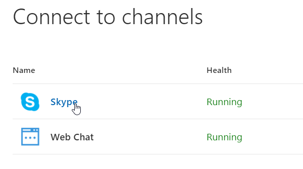

## Conclusion

In two sections, you learned how to create a simple chatbot in C#, how to send a user a message enriched with images, and how to work with persisted state between messages.

Possible extensions:

* Use RootDialog as a router that will offer the user whether he wants to get an answer to a question or to learn names.
* Ensure that the photos do not repeat (i.e. not to show the same person several times until all other faces were used).
* Load photos and people names dynamically, for example from Office 365.
* Store the user states in your own table or SQL Database.

## Additional Resources

* [Official documentation](https://docs.microsoft.com/en-us/bot-framework/)
* [Setup communication channels](https://docs.microsoft.com/en-us/bot-framework/bot-service-manage-channels)